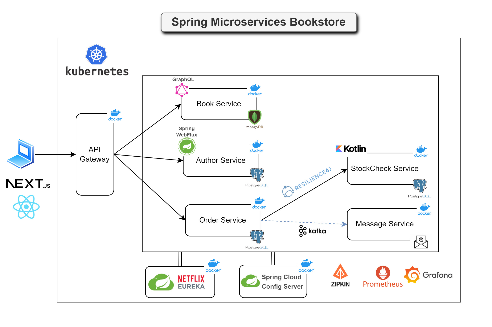
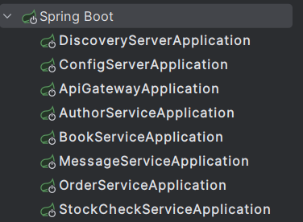

# Spring Microservices Bookstore Demo

## Overview

This project is a demo application designed to illustrate the patterns and practices used when building and managing
microservices with Spring. It features simple flows to clearly demonstrate the integration of various technologies
within a microservices architecture to build scalable and maintainable systems.

## Prerequisites
Before running the project, ensure you have the following installed:

- [Docker Desktop](https://www.docker.com/products/docker-desktop) (which includes Docker Compose)
- [Java Development Kit (JDK) 17](https://www.oracle.com/java/technologies/javase/jdk17-archive-downloads.html) or later
- [Maven](https://maven.apache.org/install.html)

## Technologies

This project demonstrates a microservices architecture using the following technologies:

### Spring Framework

- **Spring Boot 3**: For building the individual microservices.
- **Spring Web**: For building RESTful web services.
- **Spring Webflux (Reactor)**: For building non-blocking, reactive microservices.
- **Spring Cloud Netflix Eureka**: For service discovery, including registering and discovering microservices.
- **Spring Cloud Gateway**: For API gateway and routing.
- **Spring Data JPA**: For data access and ORM.
- **Spring Cloud Circuit Breaker (Resilience4J)**: For providing fault tolerance in microservices.
- **Spring for Apache Kafka**: For integrating Kafka with Spring applications.
- **Spring Boot Actuator**: For monitoring and managing Spring Boot applications.
- **Spring Cloud OpenFeign**: For creating declarative REST clients.
- **Spring Cloud Config**: For external configuration management across all microservices.

### Databases

- **PostgreSQL**: As the relational database.
- **MongoDB**: As the NoSQL database.

### Messaging and Streaming

- **Apache Kafka**: For messaging and event streaming.
- **ZooKeeper**: For managing Kafka brokers.

### Docker Ecosystem

- **Docker**: For containerizing the microservices.
- **Docker Compose**: For orchestrating multi-container Docker applications.
- **Docker Desktop**: For running Docker on local machines.

### Build and Deployment

- **Google JIB**: For building optimized Docker images for Java applications.

### API Communication
- **REST**: For traditional RESTful web service communication between microservices.
- **GraphQL**: For flexible and efficient data querying and manipulation.

### Code Quality and Efficiency

- **Lombok**: For reducing boilerplate code.

### Testing
- **JUnit and Mockito**: For unit and integration testing.
- **Testcontainers**: For providing lightweight, disposable instances of common databases, Selenium web browsers, 
or anything else that can run in a Docker container.

### Monitoring and Tracing

- **Micrometer Tracing and Brave**: For instrumenting the application and sending trace data to Zipkin.
- **Zipkin**: For collecting and viewing trace data.
- **Micrometer with Prometheus**: Micrometer collects metrics and exposes them via Spring Boot Actuator for Prometheus. 
- **Prometheus**: For monitoring and alerting.
- **Grafana**: For visualizing metrics and logs.

### Front-end

- **Next.js**: For server-side rendering, static site generation, and also the recommended framework when using React.js.
- **React.js**: Popular JavaScript framework for building interactive user interfaces.
- **Tailwind CSS**: Utility-first CSS framework to style the front-end application.

## Application Architecture

The following diagram illustrates the architecture of the Spring Microservices Bookstore application:



This architecture includes the following components:

- **API Gateway**: Acts as the entry point to the microservices architecture, routing requests to the appropriate services.
- **Book Service**: Manages book data and interacts with a MongoDB database.
- **Author Service**: Manages author profiles and interactions using a non-blocking, reactive approach with Spring Webflux.
- **Order Service**: Handles purchase transactions and interacts with a PostgreSQL database.
- **StockCheck Service**: Manages stock checking and interacts with a PostgreSQL database.
- **Message Service**: Sends messages through interactions with Kafka.
- **Eureka Discovery Server**: Registers all microservices for easy discovery and interaction.
- **Resilience4j**: Provides fault tolerance for the services.
- **Prometheus and Grafana**: Used for monitoring and visualizing metrics.

## Running the Application with Docker
To deploy and run the microservices using Docker, follow these steps:

### Prerequisites
Ensure Docker Desktop is installed and running. You **must** have Docker Desktop running, or you will encounter errors 
when you try to run the unit/integration tests and also when attempting to build the Docker images. 
If Docker Desktop is not running, you may see an error like this:

```
[ERROR] Failed to execute goal com.google.cloud.tools:jib-maven-plugin:3.2.1:dockerBuild (default) on project discovery-server: 'docker load' command failed with error: error during connect: this error may indicate that the docker daemon is not running...
```
Learn more about Docker Desktop and its setup [here](https://www.docker.com/products/docker-desktop).

Additionally, ensure you are logged into Docker Hub within Docker Desktop. This can prevent credential-related errors during the build process. You might see warnings like the following if you are not logged in:

```
[WARNING] The credential helper (docker-credential-desktop) has nothing for server URL: registry-1.docker.io
[WARNING] credentials not found in native keychain
```

You can log into Docker Hub by opening Docker Desktop, clicking on the Docker icon in your system tray, and selecting "Sign in / Create Docker ID."

### Building Docker Images for the Services
We use Google JIB to build optimized Docker and OCI images for Java applications without a Dockerfile. 
JIB integrates directly into Maven and Gradle, improving build speeds and caching.

To build Docker images locally for all services, navigate to the top-level directory and run:
```sh
mvn clean package -DskipTests
```
_Wait for the images to be created before deploying with Docker._

Note that the tests can be run, but it will take longer to build the packages.

#### Building Docker image for the Front-end Next.js Application
To build the Docker image for the front-end Next.js application, run the following commands **from the top-level directory**:
```sh
docker build -t microservices-bookstore/nextjs-frontend:latest ./frontend
```
Run this command anytime you want to update the Docker image for the front-end application.

### Deploying the Application
Deploy the application components in phases to ensure all services are initialized properly:

1. **Infrastructure Services:**
   Start by deploying the essential infrastructure components:
   ```sh
   docker-compose --profile infrastructure up -d
   ```
   Wait until all infrastructure components are fully operational before proceeding.

2. **Discovery and Configuration Servers:**
   Next, bring up the discovery and external configuration servers:
   ```sh
   docker-compose --profile discovery-config up -d
   ```
   Ensure these servers are running smoothly to facilitate service registration and configuration management.

3. **Application Services:**
   Finally, deploy the application services:
   ```sh
   docker-compose --profile services up -d
   ```

### Verification
Once all services are deployed, verify the application's functionality via the front-end application or API gateway calls.

#### Front-end Application
Navigate to [http://localhost:3000](http://localhost:3000) to access the front-end application. The page provides the following functionality:
- **List of Books:** View all available books.
- **Add a New Book:** Add a new book by entering the name, description, and price.
- **Delete a Book:** Remove a book from the list.
- **List of Authors:** View all available authors.
- **Add a New Author:** Add a new author by entering the name and birthdate.
- **Delete an Author:** Remove an author from the list.
- **Place an Order:** Select a book to place an order.
- **Microservices Links:** Access various microservices through provided links.

#### Testing with Postman
Detailed instructions and endpoints for verifying functionality through API gateway calls are available [under this heading](#testing-from-postman).

## Running the Application Services without Docker for Local Development & Testing
Running the services locally within the IDE environment allows for simple debugging, and allows for local development
and testing.

### Step 1: Start Docker Desktop

Start **Docker Desktop** and ensure it is running. Verify you are logged into Docker Hub.

### Step 2: Bring Up Infrastructure Containers

**From the top-level directory** of your project, run the following command to start the necessary infrastructure 
components such as the databases, Zipkin, Zookeeper, and the Kafka broker:

```sh
docker-compose --profile infrastructure up -d
```

### Step 3: Starting the Services

Start the `discovery-server` first. All other services will be registering with the discovery server on start up.
Next, start the `config-server` as it holds the configuration for each of the services. 
After the `config-server` is up and running, we can start the rest of the services in any order.

The simplest way to start each of the services is from within an IDE. For example, within IntelliJ each service can be
started from the Services tab as shown below:



Each IDE provides an intuitive way to do something similar.

### Step 3b: Starting the Services Manually
If you prefer to start the services manually, then open a new terminal window for each service.

#### Discovery Server

Navigate into the `discovery-server` directory and use Maven to start the service.

```sh
# Navigate to the discovery-service directory
cd discovery-server

# Compile and run the service
mvn clean compile spring-boot:run
```

#### Other Services

In a new terminal window, navigate into the `config-server` directory and use Maven to start the service.

```sh
# Example for Config Server
# Navigate to the config-server directory
cd ../config-server

# Compile and run the service
mvn clean compile spring-boot:run
```

Repeat the above steps for the following services:
- `book-service`
- `author-service`
- `api-gateway`
- `order-service`
- `stock-check-service`
- `message-service`

### Step 4: Start the Next.js Front-end
Navigate to the `frontend` directory, install dependencies if you haven't already, and start the development server.
```sh
# Navigate to the frontend directory
cd frontend

# Install dependencies
npm install

# Start the development server
npm run dev
```

Navigate to [http://localhost:3000](http://localhost:3000) to access the front-end application.

If you want to use Prometheus and Grafana, their containers can be started manually from within Docker Desktop. 

## Testing from Postman

**Note:** To make the demo project easier to work with, security has not been included within the application.
Therefore, you don't need any authorization to make calls through Postman.

If you are interested in learning how to add a security layer to the application,
I recommend taking a look at [Keycloak](https://www.keycloak.org/), an **open-source
Identity and Access Management solution** that provides features such as single sign-on, social login, and
multi-factor authentication.

### Importing the configuration
You can import the Postman configuration that is at the following location: 
`assets/Spring Microservices Bookstore Demo.postman_collection`

If you prefer to enter the configuration manually, then continue to the next subheadings.

### API Gateway Endpoints

#### View all Books

- **Endpoint URL:** `http://localhost:8080/api/graphql`
- **Method:** `POST`
- **Headers:** `Content-Type: application/json`
- **Request Body:** The request body should be in **JSON format** and contain the following query:

```json
{
  "query": "{ getAllBooks { id name description price } }"
}
```

#### Save a Book

- **Endpoint URL:** `http://localhost:8080/api/graphql`
- **Method:** `POST`
- **Headers:** `Content-Type: application/json`
- **Request Body:** The request body should be in **JSON format** and contain the following mutation:

```json
{
  "query": "mutation($book: BookRequest!) { createBook(bookRequest: $book) { id name description price } }",
  "variables": {
    "book": {
      "name": "The Mythical Man-Month: Essays on Software Engineering",
      "description": "A classic book on software project management and the pitfalls of adding manpower to late projects.",
      "price": 39
    }
  }
}
```

#### Delete a Book

- **Endpoint URL:** `http://localhost:8080/api/graphql`
- **Method:** `POST`
- **Headers:** `Content-Type: application/json`
- **Request Body:** The request body should be in **JSON format** and contain the following mutation:

```json
{
  "query": "mutation($id: ID!) { deleteBook(id: $id) }",
  "variables": {
    "id": "book-id-to-delete"
  }
}
```

Replace `"book-id-to-delete"` with the actual ID of the book you want to delete.
#### View All Authors
- **Endpoint URL:** `http://localhost:8080/api/authors`
- **Method:** `GET`

#### Save an Author
- **Endpoint URL:** `http://localhost:8080/api/authors`
- **Method:** `POST`
- **Headers:** `Content-Type: application/json`
- **Request Body:**
```json
{
  "name": "Andrew Hunt",
  "birthDate": "1974-02-19"
}
```

#### Delete an Author
- **Endpoint URL:** `http://localhost:8080/api/authors/{id}`
- **Method:** `DELETE`

#### Place an Order

- **Endpoint URL:** `http://localhost:8080/api/order`
- **Method:** `POST`
- **Headers:** `Content-Type: application/json`
- **Request Body:** The request body should be in **JSON format** and contain the following fields:

```json
{
  "orderLineItemsDtoList": [
    {
      "skuCode": "design_patterns_gof",
      "price": 29,
      "quantity": 1
    }
  ]
}
```

#### Testing 'Out of Stock' Functionality

- **Request Body:** Use the following JSON to test the 'Out of Stock' functionality:

```json
{
  "orderLineItemsDtoList": [
    {
      "skuCode": "mythical_man_month",
      "price": 39,
      "quantity": 1
    }
  ]
}
```

### Additional Endpoints for Local Development
If you would like to use Postman to make calls directly to the local services as opposed to through the API gateway then
you can utilize the following ports. 

Simply modify the port that is being used in the Postman calls above.

- **Book Service:** Running on port `8081`
- **Order Service:** Running on port `8082`
- **Author Service:** Running on port `8085`

## Accessing Services and Databases

Below are the details for connecting to the various services and databases used in the Spring Microservices Bookstore
application.

### Eureka (Discovery Server)

Eureka is used for service discovery. It allows microservices to register themselves at runtime as they appear in
the system landscape. This helps in load balancing and failover of middle-tier servers.

- **URL:** `http://localhost:8761/`

### Zipkin

Zipkin is used for distributed tracing. It helps gather timing data needed to troubleshoot latency problems
in microservice architectures. You can view the traces of your services by accessing Zipkin and clicking
on the `Run Query` button to see the trace data.

- **URL:** `http://localhost:9411/zipkin/`

### Prometheus and Grafana
The application is set up so that you can access Prometheus and Grafana when running the dockerized version 
of the application.

#### Prometheus
- **Prometheus:** Accessible at `http://localhost:9090`

#### Setting up Grafana

1. **Login to Grafana:** Go to `http://localhost:3001/login` and log in with username `admin` and password `password`.
2. **Add Data Source:**
- Under Data Sources, click on **Add your first data source**.
- Select **Prometheus** from the list.
- Configure the Prometheus data source:
  - **Name:** Spring Microservices Bookstore
  - **URL:** `http://prometheus:9090`
- Click **Save & Test** to ensure the setup is correct.

3. **Import Dashboard:**
- Hover over the **+** button on the left-side menu and select **Import**.
- Within the **Import via panel json** text area, copy and paste the JSON from the `assets/custom-dashboard-grafana.json` file.
- Click **Load** to import the dashboard.

4. **Options:**
- **Prometheus:** Choose the datasource as `Spring Microservices Bookstore`
- Click **Import**

5. **Navigation:**
- At the top left under `Instance` you can switch between services in order to visualize the application's overall health.

This setup will allow you to monitor metrics and visualize data for your Spring Microservices Bookstore application.

### Order Service Actuator and Circuit Breaker
Note that this is available when the application is dockerized, and not while running the services through your
development environment.

You can access the Order Service metrics and circuit breaker endpoints as follows:

- **Order Service Metrics:** `http://localhost:8080/order-service/actuator`
- **Circuit Breaker Health Check:** `http://localhost:8080/order-service/actuator/health`


### PostgreSQL Databases

You can connect to the PostgreSQL databases using the following connection properties:

- **Postgres-Order Database:**
    - **Host:** `localhost`
    - **Port:** `5431`
    - **Database Name:** `order_service`
    - **Username:** `admin`
    - **Password:** `password`


- **Postgres-Stock-Check Database:**
    - **Host:** `localhost`
    - **Port:** `5432`
    - **Database Name:** `stock-check-service`
    - **Username:** `admin`
    - **Password:** `password`

You can use [pgAdmin](https://www.pgadmin.org/) to connect to these PostgreSQL databases and manage them. **pgAdmin** is a popular open-source administration and development platform for PostgreSQL that allows you to execute queries, manage data, and visualize database structures.

### MongoDB Database

You can connect to the MongoDB database using the following details:

- **Host:** `localhost`
    - **Port:** `27017`
    - **Database Name:** `book-service`
    - **Username:** Not required
    - **Password:** Not required

You can use [MongoDB Compass](https://www.mongodb.com/books/compass) to connect to the MongoDB instance and explore the database. MongoDB Compass is a GUI for MongoDB that allows you to visualize and interact with your data easily.


## Docker Containers - Cleaning Up
To stop and remove all the containers, networks, and volumes created by Docker Compose for this project, 
run the following command **from the top-level directory** of your project:

```sh
docker-compose -p spring-microservices-bookstore-demo down
```
